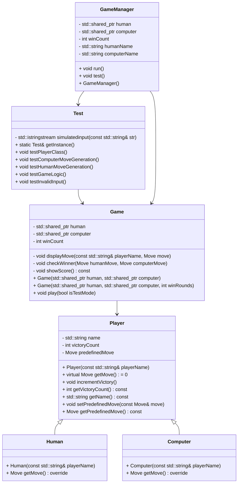

# Rock-Paper-Scissors Game UML Class Diagram

```mermaid
classDiagram
    class Player {
        - std::string name
        - int victoryCount
        - Move predefinedMove
        + Player(const std::string& playerName)
        + virtual Move getMove() = 0
        + void incrementVictory()
        + int getVictoryCount() const
        + std::string getName() const
        + void setPredefinedMove(const Move& move)
        + Move getPredefinedMove() const
    }

    class Human {
        + Human(const std::string& playerName)
        + Move getMove() override
    }

    class Computer {
        + Computer(const std::string& playerName)
        + Move getMove() override
    }

    class Game {
        - std::shared_ptr<Human> human
        - std::shared_ptr<Computer> computer
        - int winCount
        - void displayMove(const std::string& playerName, Move move)
        - void checkWinner(Move humanMove, Move computerMove)
        - void showScore() const
        + Game(std::shared_ptr<Human> human, std::shared_ptr<Computer> computer)
        + Game(std::shared_ptr<Human> human, std::shared_ptr<Computer> computer, int winRounds)
        + void play(bool isTestMode)
    }

    class Test {
        - std::istringstream simulatedinput(const std::string& str)
        + static Test& getInstance()
        + void testPlayerClass()
        + void testComputerMoveGeneration()
        + void testHumanMoveGeneration()
        + void testGameLogic()
        + void testInvalidInput()
    }
	
	class GameManager {
		- std::shared_ptr<Human> human
        - std::shared_ptr<Computer> computer
		- int winCount
		- std::string humanName
		- std::string computerName
		+ void run()
		+ void test()
		+ GameManager()
	}

    Player <|-- Human
    Player <|-- Computer
    Game --> Player
    Test --> Game
	GameManager --> Game
	GameManager --> Test
```