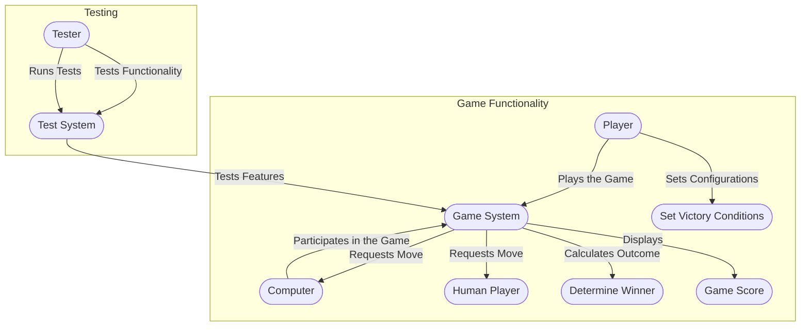

# title Rock-Paper-Scissors Game Use Case Diagram  

## Explanation:  

1. **Actors**:  
   - **Primary Actor**:   
     - **Player**: The user of the game who interacts by making moves, viewing scores, and setting victory conditions.  
   - **Secondary Actor**:   
     - **Computer**: Simulated opponent that generates moves to play against the human player.  
     - **Tester**: Runs automated or manual tests to validate the game functionality.  

2. **Use Cases**:  
   - **Game Functionality**:  
     - The game system interacts with the human player and the computer to get moves, determine the winner, and display the score.  
     - The player configures victory conditions and plays the game.  
   - **Testing**:  
     - The tester uses the testing system to validate core functionalities like move generation, winner calculation, and invalid input handling.  